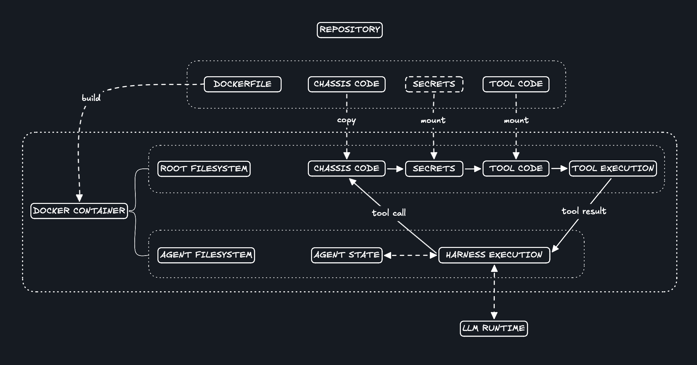

# chassis 🏎️

[](LICENSE)
[](https://docs.docker.com/)
[](https://www.python.org/)


<i>A minimal Docker 'chassis' for managing long-running agent fleets.</i>

`chassis` is a bare-bones agent orchestration layer designed around a two user agent-native file system running in docker. The goal is to streamline the agent/task hierarchy into its simplest form for maximum extensibility and minimal bloat.

> Although it could be used as one, this repository is not intended to be an OpenClaw replacement. The purpose of this repository is to facilitate an open-ended branch of multi-agent systems development and research, and to serve as the foundation for several other projects.

a chassis is a docker container with an agent user:
```
/home/agent
```

an agent is a directory containing a system prompt and a config:
```
/home/agent/{agent-name}/SYSTEM.md
/home/agent/{agent-name}/agent.json
```

a task is a directory containing an instruction prompt and a launch rule — a cron schedule, a trigger pointing at another task, or both:
```
/home/agent/{agent-name}/{task-name}/INSTRUCTIONS.md
/home/agent/{agent-name}/{task-name}/cron       # scheduled — single cron line
/home/agent/{agent-name}/{task-name}/trigger    # event-driven — see Triggers
```

These three base abstractions allow for an extremely general surface for configuring a large number of multi-agent systems.


> * a simplified visual description of a chassis based agent system

Each chassis is one container holding a fleet of cron-driven agents. Secrets live in a root-only file and only land in validated tool calls; never in the agent's address space. The LLM runtime and source is pluggable; the default is [Pi](https://github.com/earendil-works/pi-coding-agent), swappable per branch (see [Branches](#branches)). Per-branch namespacing lets several chassis run side by side on one host; multi-tenant chassis operation is a core feature.

## Example chassis

An agent is a directory:

```
/home/agent/researcher/
  SYSTEM.md          ← system prompt
  agent.json         ← { "tools": [...], "pi_defaults": [...], "model": "" }
  tasks/morning/     ← optional; one per scheduled or named run
    INSTRUCTIONS.md  ← prompt for this run
    cron             ← single line, e.g. `0 7 * * *`
    trigger         ← optional; e.g. `after researcher/scrape` (see Triggers)
```

The seeded `driver` agent can edit, observe, scaffold, and launch other agents from inside the container.

## Quick start

```sh
./chassis install        # bind chassis command

chassis init             # scaffold .env (mode 600)
vim .env                 # add LLM_API_KEY + any tool secrets
chassis up               # build and start
chassis run driver       # interactive session with the seeded driver agent
```

## How it works

- **One container per chassis.** Cron runs scheduled tasks; triggers fan out from completed tasks; the seeded `driver` agent is your interactive mode.
- **Two users.** `root` owns the runtime, tools, secrets, and cron. `agent` (UID 2000) owns its home and every agent definition, on a persistent volume.
- **Privileged tool dispatcher.** Agents call `sudo run-tool <name> '<json-args>'`. The dispatcher validates args against a JSON schema and injects only the declared secrets into the tool's child env. See [`tools/README.md`](tools/README.md) for the contract.
- **Audit log.** Every dispatcher call appends to `/var/log/chassis/run-tool.jsonl` with secrets redacted from stdout/stderr. Trigger fan-outs append to `/var/log/chassis/triggers.log`.
- **Dashboard.** [`dashboard/`](dashboard/) is a single-chassis web monitor: cron schedules, last agent runs, audit tail, and a drill-in for individual sessions. Auto-picks the chassis when one is running; pass `--chassis <name>` for multiples.

## Triggers

A task can be launched from a `cron` line (time), from a `trigger` line (the completion of another task), or both. The trigger file is a single line, parsed at fire time — no `reload-cron` needed when you add or edit one.

Grammar:
```
after      <agent>/<task> [when <key> <op> <value>]    # fire when that task completes (any exit)
on_success <agent>/<task> [when <key> <op> <value>]    # fire only on exit 0
on_failure <agent>/<task> [when <key> <op> <value>]    # fire only on non-zero exit
```

The optional `when` clause gates the trigger on a verdict published by the upstream task (see [Verdicts](#verdicts) below). `<op>` is one of `==`, `!=`, `<`, `>`, `<=`, `>=` — equality compares as strings, ordering requires both sides to be integers. **A `when` clause whose verdict key is missing does not fire** — every routing path must either publish a matching verdict or fall through to a plain `on_failure` safety net.

### Verdicts

A task publishes named verdicts via the `verdict` tool — `verdict {"score": 7}` — and downstream `when` clauses route on them. Verdicts are scalar k/v pairs; last write per key wins; they're scoped to one task run (a fresh file per invocation, removed by `run-agent` after fan-out).

Example — score-routed editing pipeline:
```
/home/agent/writer/draft/INSTRUCTIONS.md
/home/agent/writer/draft/cron                  0 9 * * *
/home/agent/writer/draft/trigger               after reviewer/eval when score <= 5

/home/agent/reviewer/eval/INSTRUCTIONS.md       # …calls `verdict {"score": <0..10>}`
/home/agent/reviewer/eval/trigger              on_success writer/draft

/home/agent/editor/polish/INSTRUCTIONS.md
/home/agent/editor/polish/trigger              after reviewer/eval when score > 5

/home/agent/writer/fix/INSTRUCTIONS.md
/home/agent/writer/fix/trigger                 on_failure reviewer/eval
```

A high score routes the draft to `editor/polish`; a low score loops back to `writer/draft`; if the reviewer itself crashes, `writer/fix` is the safety net.

Fan-out happens at the tail of `run-agent`: when a task finishes, every sibling `trigger` file whose reference matches the just-completed `(agent, task)` is fired in the background via `setsid run-agent`. Interactive sessions (no task argument) do not fan out.

**Cycles are allowed by design** — `A → B → A` is a legitimate feedback loop (e.g. writer ↔ reviewer iterating). There's no DAG check; if you spin up a runaway loop, `pkill -f run-agent` inside the container is the off switch.

## Tools

Tools are scripts in `tools/` registered in [`tools/tools.json`](tools/tools.json). The dispatcher validates args against each tool's JSON schema and injects only the declared `.env` secrets into the child process.

| Tool | What it does | Secrets |
|---|---|---|
| `web-search` | DuckDuckGo HTML scrape (no key); returns title/url/content. | — |
| `web-fetch` | Fetch http(s) URL, optional tag-strip, char-capped. | — |
| `verdict` | Publish k/v scalars consumed by downstream `when` clauses. See [Verdicts](#verdicts). | — |

Add a tool: drop a script in `tools/`, append an entry to `tools.json`, run `chassis reload-cron`. See [`tools/README.md`](tools/README.md) for the full contract.

## LLM endpoint

Configured in `harness/llm.env` (committed; branch-specific). Point `LLM_BASE_URL` at any OpenAI-compatible endpoint:

| Provider | Setup |
|---|---|
| **Hosted (OpenRouter / OpenAI / etc.)** | Set `LLM_BASE_URL` and `LLM_MODEL_ID` in `harness/llm.env`; put `LLM_API_KEY=...` in `.env`. |
| **Local Docker container (vLLM, llama.cpp, ollama, ...)** | Run your LLM container, then set `LLM_CONTAINER=<its-name>` in `harness/llm.env`. `chassis up` attaches it to `chassis-net` with alias `llm`, so `LLM_BASE_URL=http://llm:<port>/v1` resolves. |

`.env` (mode 600) holds the API key and tool secrets; `harness/llm.env` holds non-secret config.

## Branches

The branch name *is* the chassis name. `main` is the framework; running `chassis up` on it produces a chassis named `default`. Every other branch becomes a chassis with that branch's name (lowercased, docker-sanitized).

Two flavors of branches:

- **`harness-<runtime>`** — alternative agent runtimes on the same framework. Cron, per-agent dirs, dispatcher, and the `chassis` CLI are unchanged; only the runtime differs.
- **`<anything else>`** — a concrete configuration: added tools, seeded agents, scheduled tasks. Layered on `main` (or a harness branch) and rebased onto it periodically.

### Published

| Branch | What it is |
|---|---|
| `main` | Framework + Pi runtime. Start here. |
| `harness-pi-agent` | Pi runtime under the explicit name; currently mirrors `main`. |
| `harness-claude-code` | Claude Code runtime in place of Pi. |

PR for `harness-codex` welcome.

## Worktrees workflow

Each branch lives in its own git worktree, so you can run multiple chassis at once and edit one while another is running. Flat branch names mean no nested directories.

```
agents/
├── chassis/        # main -the clone
├── researcher/     # researcher branch
└── …               # one dir per chassis
```

```sh
mkdir agents && cd agents
git clone git@github.com:theo-kirby/chassis.git chassis
cd chassis
git worktree add ../researcher researcher          # existing branch
git worktree add -b mything ../mything main        # new branch off main
```

The `chassis` CLI namespaces containers, volumes, and networks by branch. `chassis up` in two different worktrees brings up two independent chassis side by side. Set `CHASSIS_NAME=<name>` to override the branch-derived default.

## Testing

```sh
./chassis test ping  # against current config
./chassis test ping --set LLM_BASE_URL=https://openrouter.ai/api/v1 \
                    --set LLM_API_KEY=sk-or-v1-... \
                    --set LLM_MODEL_ID=anthropic/claude-sonnet-4-5
```

Spins up a fully-namespaced throwaway container (own image tag, volumes, network), runs `harness/tests/<name>` against it, then tears it all down. `--set` injects env that wins over `harness/llm.env` and `.env`.

## When to rebuild

| Changed | Run |
|---|---|
| Agent files in `/home/agent/agents/` (including `trigger`) | nothing |
| Agent cron, or `tools/` on host | `chassis reload-cron` |
| `.env` | `chassis down && chassis up` |
| Anything in `harness/` | `chassis up` |

## Security

All agents in one chassis share one Linux user, so any agent can call any registered tool, write tools assuming that. The trust boundary is the dispatcher: secrets live in mode-600 `.env` (root-owned in container), tool implementations live behind mode-700 `/mnt/protected/` (root-only), and the only thing on the agent's passwordless sudo list is `run-tool`. The dashboard is read-only and has no auth, don't expose it on the open internet; use a tailnet ACL or equivalent.


